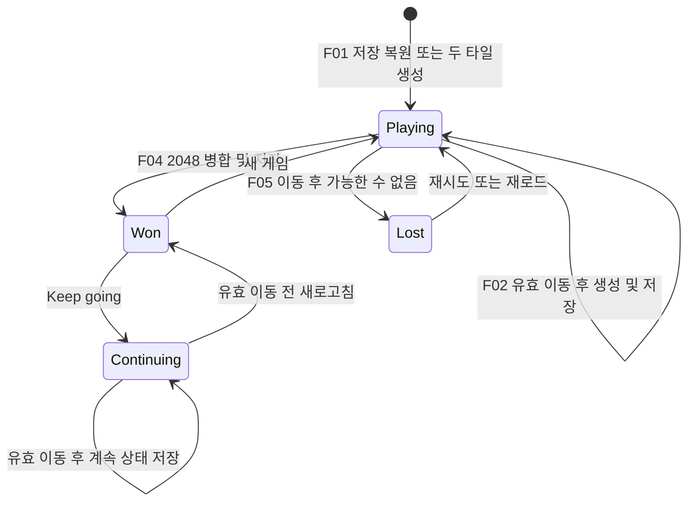

# 호출 및 상태 전이

```mermaid
stateDiagram-v2
    [*] --> Playing: F01 저장 복원 또는 두 타일 생성
    Playing --> Playing: F02 유효 이동 후 생성 및 저장
    Playing --> Won: F04 2048 병합 및 저장
    Won --> Continuing: Keep going
    Continuing --> Won: 유효 이동 전 새로고침
    Continuing --> Continuing: 유효 이동 후 계속 상태 저장
    Playing --> Lost: F05 이동 후 가능한 수 없음
    Lost --> Playing: 재시도 또는 재로드
    Won --> Playing: 새 게임
```
F02 변경이 없는 입력은 생성·저장·렌더 호출 없이 끝난다. F03 재시작은 진행판 삭제 → 오버레이 해제 → 새 판 저장 → 렌더 순이다. F05는 진행판을 비운 후 패배 정보를 렌더러에 전달한다.
